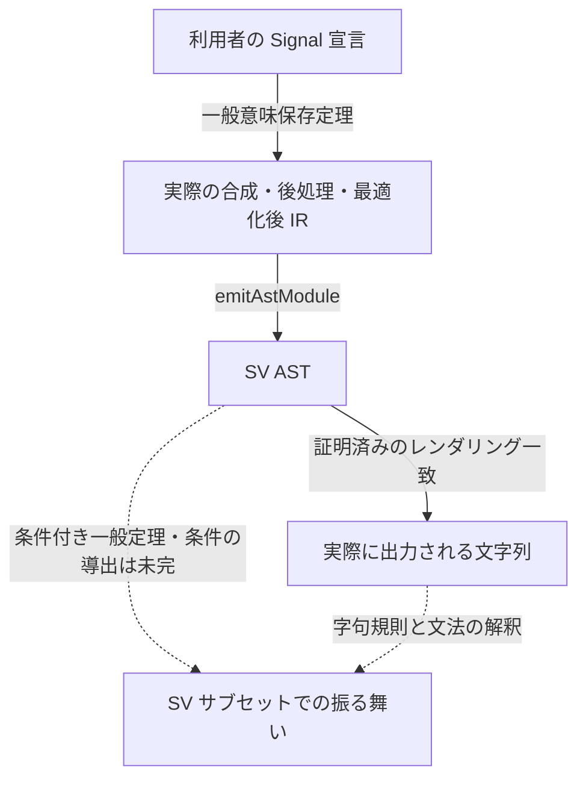

# Chapter 7c — 証明を、出力ファイルまで届ける

第7章では、二つの回路を Lean の中で比較しました。ここでは、その先を
考えます。Lean で正しいと証明した回路をコンパイルしたとき、**出力された
回路にも、その正しさが届いているでしょうか。**

加算を間違って減算として出力するコンパイラなら、ソースの証明は通っても、
できた回路は別物です。変数の取り違え、幅の切り詰め、最適化、名前の印字も、
同じように意味を変える可能性があります。ソースの証明から出力の保証へ
進むには、この間を証明でつなぐ必要があります。

この章は、その接続を実際のコードで追います。目標はコンパイラ全体の意味保存
ですが、現在一般証明が通っているのは限定された組合せ回路の範囲です。
**完成済みの RTL 正当性定理としては紹介しません。** どこまで届いたか、
どの矢印が最後に残っているかも、定理の一部として読んでいきます。

## 7c.1 証明したいのは「成功した変換」の正しさ

目標の形を、まず日本語で書いてみましょう。

```text
許容される環境でソース f をコンパイルして、RTL v の生成に成功したなら、
すべての入力について、v の振る舞いは f の振る舞いと一致する。
```

任意の Lean プログラムを回路に変換する必要はありません。変換できない形は
拒否できます。ただし、**成功したのに違う意味を持つ回路を出す**ことは許せません。

現在の一般定理には、さらに対象の制限があります。入力と結果が同じ正の固定幅の
`BitVec` の Signal で、入力参照・ビットベクトル定数・標準の
`+ - * &&& ||| ^^^` から組み立てられた宣言を扱います。
レジスタ、メモリ、階層、シフトなどまで含めた、コンパイラの成功領域全体は
まだ覆っていません。以下の例は、この証明済みの範囲から選びます。

## 7c.2 小さな加算器から始める

```lean
import Tools.ShippingSVBridge

open Lean Elab Command
open Sparkle.Core.Domain Sparkle.Core.Signal Sparkle.Compiler.Elab
open Tools.ShippingEntrySoundness Tools.ShippingPrintEntrySoundness

namespace Notebooks.Ch07c

def plus8 {dom : DomainConfig}
    (a b : Signal dom (BitVec 8)) : Signal dom (BitVec 8) :=
  a + b

#synthesizeVerilog plus8

-- 8-bit addition is modular addition, not unbounded integer addition.
#eval ((250 : BitVec 8) + 10).toNat -- 4
```

`#synthesizeVerilog` は、普段使っている合成入口です。証明専用の別コンパイラ
を動かしているわけではありません。しかし、この実行例だけでは一つの変換が
動いたことしか分かりません。すべての入力で正しいことは、次の一般定理から得ます。

証明で扱う式の表現も用意します。`.inp 0` と `.inp 1` は二つの入力、
`.bin .add` は加算です。

```lean
def plus8Expr : FExpr := .bin .add (.inp 0) (.inp 1)

theorem plus8_source {dom : DomainConfig}
    (a b : Signal dom (BitVec 8)) :
    denoteFE 8 (fun j => if j = 0 then a else b) plus8Expr = plus8 a b := rfl

#def_decl_value plus8Value of plus8

theorem plus8Value_eq :
    plus8Value = quoteDecl `dom [`a, `b] 8 plus8Expr := rfl
```

ここには、別々の二つの接続があります。

- `plus8_source` は、式の意味が利用者の書いた `plus8` と同じことを示します。
- `plus8Value_eq` は、Lean が実際に elaboration した宣言の本体が、その式の
  引用と一致することを示します。`#def_decl_value` で取り出した本体を、
  `rfl` で検査しています。

手で「これが加算器の仕様だ」と書いただけでは、実際にコンパイルする宣言との
取り違えを防げません。この二つの小さな証明が、その取り違えを防ぐ入口です。
キャッシュや演算子の型クラスを扱う際にも、見た目の演算子名ではなく、
実際に読まれた式とその意味を結び付けることが重要になります。

## 7c.3 出力につながる一本の実行を固定する

一般定理を適用します。引数が長く見えるのは、**同じ合成実行**の環境・状態・
入出力を明示しているためです。証明本体は最後の2行です。

```lean
theorem plus8_artifact
    {mctx : Meta.Context} {mref : ST.Ref IO.RealWorld Meta.State}
    {cctx : Core.Context} {cref : ST.Ref IO.RealWorld Core.State}
    {w w' : Void IO.RealWorld}
    {m : Sparkle.IR.AST.Module} {d : Sparkle.IR.AST.Design}
    (h : RunsTo (synthesizeCombinational ``plus8)
      mctx mref cctx cref w (m, d) w')
    (henv : EnvDefines mctx mref cctx cref ``plus8 plus8Value) :
    FragmentArtifact m [`a, `b] 8 plus8Expr := by
  rw [plus8Value_eq] at henv
  exact compiledFragment_artifact h henv
    (by simp [plus8Expr, FExpr.WF]) (by decide)

#print axioms plus8_artifact
```

`RunsTo` は、実際の `synthesizeCombinational` がこの実行で `m` を返した、
という条件です。別の実行で読んだ宣言と、この実行の出力を結び付けてはいません。

`EnvDefines` は明示的に残る信頼境界です。その環境で `plus8` を問い合わせたら、
引用した本体が返る、と仮定しています。Lean の実行環境を保持する参照の内容
まで、ここで無条件に証明したわけではありません。

この定理の公理依存は `propext`、`Classical.choice`、`Quot.sound` の範囲です。
ただし、公理一覧が標準のものだけでも、**定理の引数にある仮定が消えるわけでは
ありません**。`EnvDefines` と対象断片の制限は、定理を読むときにも残ります。

## 7c.4 この定理は何を保証しているか

`FragmentArtifact` は、同じ出力について次の二つをまとめています。

| 接続 | 現在証明されていること |
|---|---|
| ソース → 印字直前の IR | すべての入力信号と時刻について、入力を対応するポートに与えると、最適化後 IR の `out` はソースの値と一致する |
| 印字直前の IR → AST → 文字列 | その IR の SV AST が存在し、その AST のレンダリングは出荷版プリンタの文字列と完全に一致する |

入力ポートの対応も結論に含まれ、異なる入力が同じポートへ潰れないことが
保証されます。対象は組合せ回路なので、時刻についての量化は各時点の入力を
読むという意味です。レジスタの時間方向の保存証明を済ませたという意味ではありません。



図の実線が増えたことには大きな意味があります。コンパイラのモデルについての
補題だけでなく、普段の合成入口、実際の最適化結果、実際の出力文字列が、
同じ定理の中で指し示されるようになりました。

一方、**文字列の一致だけから、その文字列の RTL としての意味の一致は出ません。**
たとえば不正な識別子を二つのレンダラが同じように出力しても、文字列一致は成立します。
また、IR と Verilog では、演算や代入の幅の扱いが同じとは限りません。
そのため図には破線を残しています。

## 7c.5 短い適用証明の裏で、何を証明したのか

最後の `exact` が短いのは、必要な仕事を前段の一般定理で済ませたからです。

1. **変換器の再帰。** 入力参照・定数・演算の分岐について不変条件の保存を証明し、
   燃料についての帰納法で再帰呼び出しへの仮定を解消しました。
2. **変数とキャッシュ。** wire の新鮮性、束縛された入力の値と幅、生成した式と
   wire の対応を保持します。証明対象の経路では、従来のキャッシュの候補を、
   純粋な記録と証明可能な式の等価性で検査してから再利用します。
3. **後処理と最適化。** ゼロ幅除去の条件を生成結果から導きます。重複除去や
   最適化では、変換候補を健全性が証明された検査器に通し、不合格なら元を使います。
   最適化アルゴリズム自体の一般正当性を証明した、という主張ではありません。
4. **プリンタの前提。** 宣言の型やモジュール属性を、合成・後処理・最適化の
   両分岐から導きます。「印字できると仮定する」を利用者に残してはいません。

最適化の検査は有限個の入力で試すテストではありません。**検査に合格した候補は
すべての許容入力で同じ出力を持つ**という定理が、検査器について証明されています。
変換候補の生成を信頼しなくても、この定理を通して意味保存を得られます。

この方式と、個別回路の意味を毎回 SAT 等で認証する方式は区別しましょう。
この章の `plus8_artifact` は個別の意味認証を生成していません。一般定理に、
宣言が対象に入るという事実を渡しています。crc16 へ進む際にも、目指すのは
その構文・状態を一般証明が扱えるようにすることです。crc16 だけを再認証しても、
一般証明の範囲は広がりません。

## 7c.6 クライマックスへ、残っている接続

次に必要なのは、図の破線を根拠のある矢印へ変えることです。

このうち AST から振る舞いへの接続は、現在
`ShippingSVBridge.compiledFragment_forward` という**条件付きの一般定理**に
なっています。実際の AST から取り出した代入列について、既存の SV サブセットの
逐次的な代入評価がソースと一致します。名前変換が wire 名を変えないことと、
初期環境の値が幅に収まることは、まだ仮定しています。一方、最終 IR の幅検査に
合格するという仮定は、以下の一般証明によって消せました。

ここで実際に見つかった接続の問題が、出力ポートの幅でした。ソース側の IR 評価は
内部 wire の幅表を使い、そこにない `out` は幅 0。一方、プリンタは出力ポートの
宣言も読むので幅 8 です。右辺が読む名前で幅が一致すれば IR の評価を変えずに
幅環境を移せる、という一般補題で、二つの定理をつなぎました。個々の補題が正しくても、
つなぐ箇所で同じ対象を指しているかを確認する仕事が必要なのです。

さらに、合成の core 入口では幅条件を仮定から結論へ移せました。
変換器が代入を追加するたびに「右辺は代入先と同じ幅」という不変条件を保ち、
空の初期状態からこれを成立させます。`core_forwardCheck` は、この事実から
名前変換が安定している場合の検査合格を導きます。利用者に幅の証明を追加で
要求してはいません。

この不変条件は、今ではゼロ幅の除去と重複除去を越え、実際の
`synthesizeCombinational` の返す IR まで届いています。重複除去では、同じ式を
計算する二本目の wire を、一本目への参照に置き換えます。「同じ式」だけでは
足りず、検査器が代入先どうしの幅の一致も確かめていることが証明に効きます。
置換表が幅を保つことを一段ずつ示すと、置換後の右辺も元の幅を保ちます。
`out` は内部 wire ではないので、その例外も別に扱っています。

`synthesized_forwardCheck` は、この結果から最適化前の IR の検査合格を導きます。
そして、最適化の採否を決める実装にも接続しました。入力がこの幅条件を満たすなら、
最適化した候補にも同じ条件を要求します。候補が検査に落ちれば、証明済みの元の
IR に戻ります。「候補を採用する」と「元に戻す」のどちらも正しいので、最終定理の
利用者が最適化後の幅検査を証明する必要はなくなりました。

ここは、個別回路の検査に成功したという話とは違います。検査器が通した候補は
必ず条件を満たすこと、元の IR はソースの不変条件から条件を満たすことを一般に
証明し、実際のコンパイラの選択へ適用しています。`compiledFragment_forward`
から幅検査の仮定が一つ消えたのは、この接続の結果です。

先ほどの `plus8` に適用してみます。最適化後の IR を実行して検査するのではなく、
任意の成功した実行について、一般定理から検査の合格を導いています。

```lean
theorem plus8_forward_check
    {mctx : Meta.Context} {mref : ST.Ref IO.RealWorld Meta.State}
    {cctx : Core.Context} {cref : ST.Ref IO.RealWorld Core.State}
    {w w' : Void IO.RealWorld}
    {m : Sparkle.IR.AST.Module} {d : Sparkle.IR.AST.Design}
    (h : RunsTo (synthesizeCombinational ``plus8)
      mctx mref cctx cref w (m, d) w')
    (henv : EnvDefines mctx mref cctx cref ``plus8 plus8Value)
    (hnames : ∀ p ∈ m.wires,
      Sparkle.Backend.Verilog.sanitizeName p.name = p.name) :
    Tools.ShippingSVBridge.forwardCheck (Sparkle.IR.OptCheck.checkedOptimize m) = true := by
  rw [plus8Value_eq] at henv
  exact Tools.ShippingSVBridge.compiled_forwardCheck h henv
    (by simp [plus8Expr, FExpr.WF]) (by decide) hnames

#print axioms plus8_forward_check
```

`hnames` はまだ残っている名前の条件です。これを幅の証明に紛れ込ませず、
識別子の検討として次に扱える形にしています。

- **識別子。** 先頭文字、予約語、生成名、名前の衝突を扱います。名前変換で
  変わらないことだけでは足りません。`1bad` や `module` がその例です。
- **初期値。** 幅検査は最適化の両分岐まで導けました。次は、入力の値から
  初期環境を作り、既存の SV 意味保存定理が要求する有界性を導きます。
- **合成。** 同じ AST・同じ文字列について、ソースの意味と SV サブセットの
  意味をつなぎます。外部ツールが文字列をその文法どおり読むという信頼境界は、
  別途明記します。

ここを越えると、限定断片について「ソースで証明した性質が、生成された RTL の
意味にも届く」と言うための接続が揃います。その後に、状態・メモリ・階層などへ
一般定理を広げる仕事が続きます。

実装と現在地は [ShippingCompiler-Soundness.md](../../ShippingCompiler-Soundness.md)
に記録しています。読みたい定理は
[ShippingPrintEntrySoundness.lean](../../../Tools/ShippingPrintEntrySoundness.lean) の
`compiledFragment_artifact` と、その結論 `FragmentArtifact` です。

```lean
-- Keep the chapter's trust claim executable, rather than only printing it.
run_cmd do
  for name in [``plus8_artifact, ``plus8_forward_check] do
    for ax in (← liftCoreM <| collectAxioms name) do
      unless [``propext, ``Classical.choice, ``Quot.sound].contains ax do
        throwError "unexpected tutorial axiom: {name}: {ax}"

end Notebooks.Ch07c
```
