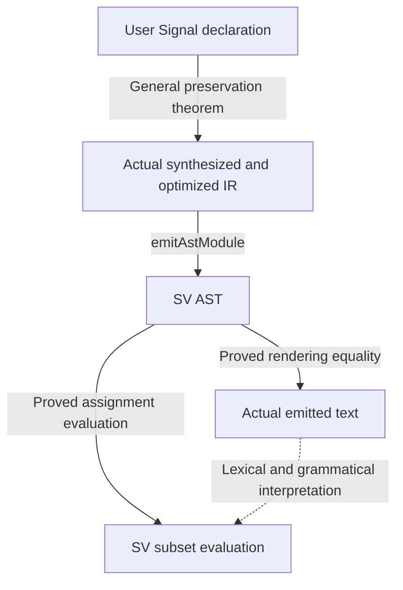

# Chapter 7c — Carrying a Proof to the Output File

Chapter 7 compared two circuits inside Lean. Now consider what happens next.
After compiling a circuit whose properties we proved in Lean, **do those
properties still hold for the circuit we actually emit?**

A compiler that emits subtraction for addition can pass every source-level
proof and still produce the wrong circuit. Variable bindings, truncation,
optimization, and printed names can all change meaning. We need proofs that
connect the source to the output.

This chapter follows that connection through executable examples. The goal is
compiler-wide semantic preservation; the current general theorem covers a
restricted combinational fragment. This is a work in progress, **not a claim
that complete RTL correctness has already been proved**. We will read both the
connections and the remaining gaps as part of the theorem.

## 7c.1 Correctness of successful compilation

The intended goal is:

```text
If compiling source f in an admissible environment succeeds and produces RTL v,
then v behaves like f for every input.
```

The compiler need not accept every Lean program. It may refuse unsupported
forms. What it must not do is **succeed while producing a different meaning**.
An IR-generation success and a successful, valid RTL emission are distinct
stages; a proof must connect them rather than silently change the meaning of
“success.”

The current general theorem has a narrower scope: declarations whose inputs
and result are Signals of the same positive, literal BitVec width, built from
input references, bit-vector literals, and the canonical operators
`+ - * &&& ||| ^^^`. Registers, memories, hierarchy, shifts, and the rest of
the compiler's accepted language are not yet covered. Our examples lie inside
this fragment.

## 7c.2 Start with a small adder

```lean
import Tools.ShippingSVBridge

open Lean Elab Command
open Sparkle.Core.Domain Sparkle.Core.Signal Sparkle.Compiler.Elab
open Tools.ShippingEntrySoundness Tools.ShippingPrintEntrySoundness

namespace Notebooks.Ch07c

def plus8 {dom : DomainConfig}
    (a b : Signal dom (BitVec 8)) : Signal dom (BitVec 8) :=
  a + b

#synthesizeVerilog plus8

-- 8-bit addition is modular addition, not unbounded integer addition.
#eval ((250 : BitVec 8) + 10).toNat -- 4
```

`#synthesizeVerilog` is the usual synthesis entry, not a separate compiler
built only for the proof. Running it demonstrates one translation. Correctness
for every input comes from applying the general theorem below.

We also describe the expression in the proof's syntax. `.inp 0` and
`.inp 1` are its two inputs; `.bin .add` is addition.

```lean
def plus8Expr : FExpr := .bin .add (.inp 0) (.inp 1)

theorem plus8_source {dom : DomainConfig}
    (a b : Signal dom (BitVec 8)) :
    denoteFE 8 (fun j => if j = 0 then a else b) plus8Expr = plus8 a b := rfl

#def_decl_value plus8Value of plus8

theorem plus8Value_eq :
    plus8Value = quoteDecl `dom [`a, `b] 8 plus8Expr := rfl
```

These are two different connections:

- `plus8_source` identifies the expression's meaning with the user's `plus8`.
- `plus8Value_eq` identifies Lean's elaborated declaration body with the
  quoted expression. `#def_decl_value` retrieves the body, and `rfl` checks
  the equality.

Writing down an adder specification by hand would not prevent us from proving
a theorem about the wrong declaration. These two proofs establish the source
connection. The same discipline matters for caches and operator instances:
we must connect the expression actually read to its meaning, rather than rely
on the spelling of an operator.

## 7c.3 Fix the run that produced the output

The argument list is long because it identifies the environment, state, and
output of **one particular synthesis run**. The application proof itself is
the final two lines.

```lean
theorem plus8_artifact
    {mctx : Meta.Context} {mref : ST.Ref IO.RealWorld Meta.State}
    {cctx : Core.Context} {cref : ST.Ref IO.RealWorld Core.State}
    {w w' : Void IO.RealWorld}
    {m : Sparkle.IR.AST.Module} {d : Sparkle.IR.AST.Design}
    (h : RunsTo (synthesizeCombinational ``plus8)
      mctx mref cctx cref w (m, d) w')
    (henv : EnvDefines mctx mref cctx cref ``plus8 plus8Value) :
    FragmentArtifact m [`a, `b] 8 plus8Expr := by
  rw [plus8Value_eq] at henv
  exact compiledFragment_artifact h henv
    (by simp [plus8Expr, FExpr.WF]) (by decide)

#print axioms plus8_artifact
```

`RunsTo` says that the actual `synthesizeCombinational` returned `m` in
this run. It does not attach a declaration read in some other run to this
run's output.

`EnvDefines` remains an explicit assumption: querying `plus8` in that
environment returns the quoted body. We have not unconditionally proved the
contents of the reference holding Lean's runtime environment.

The theorem depends only on the standard axioms `propext`,
`Classical.choice`, and `Quot.sound`. An axiom audit does **not** discharge
the hypotheses in a theorem's argument list. The environment assumption and
the fragment restriction still matter.

## 7c.4 What does the theorem guarantee?

`FragmentArtifact` combines two results about the same output:

| Connection | What is proved |
|---|---|
| Source → IR immediately before printing | For every input signal and time, supplying the corresponding input ports makes the optimized IR's `out` equal the source value. |
| IR → AST → text | That IR has an SV AST whose rendering is byte-for-byte equal to the shipping printer's output. |

The conclusion includes an injective input-to-port mapping: distinct inputs
do not collapse onto one IR port. Since the fragment is combinational, the
time quantifier samples the inputs at each instant. It does not establish
preservation of register state over time.



These connections matter because the theorem now refers to the ordinary
compiler entry, its actual optimizer selection, and its actual output text.
It is not merely a theorem about an idealized compiler model.

However, **equal strings do not by themselves imply correct RTL meaning**.
Two renderers can produce the same invalid identifier. The later proof handles
the IR-to-SV width boundary and assignment evaluation. The text-to-grammar
connection remains open, as does the connection from an in-order assignment
fold to concurrent RTL behavior.

## 7c.5 What makes the short application possible?

The final `exact` is short because earlier general theorems do the work:

1. **Translator recursion.** The input, literal, and operator branches preserve
   an invariant. Induction on fuel discharges the recursive-call hypotheses.
2. **Bindings and caches.** The invariant tracks fresh wires, bound input
   values and widths, and the correspondence between expressions and wires.
   On the proved path, the old cache supplies candidates; pure records and a
   provable expression equality check validate candidates before reuse.
3. **Cleanup and optimization.** The generated module supplies the zero-width
   pass's conditions. Deduplication and optimization submit candidates to
   proved-sound checkers, falling back to the original on rejection. This is
   not an unconditional correctness proof of the optimizer algorithm itself.
4. **Printer prerequisites.** Declaration types and module attributes follow
   from synthesis, cleanup, and both optimizer-selection branches. The caller
   does not have to assume that the module is printable.

The optimizer checker does not test a few sample inputs. Its theorem says
that **every accepted candidate has the same outputs for all admissible
inputs**. Candidate generation can remain untrusted because the checker has
that general soundness theorem.

This also differs from generating a SAT-based semantic certificate separately
for each circuit. `plus8_artifact` applies a general theorem using evidence
that its declaration belongs to the fragment. Extending the result to crc16
requires extending the general proof to its syntax and state. Re-certifying
crc16 alone would not enlarge the general theorem's scope.

## 7c.6 Closing the remaining connections

The next task is to justify the unfinished arrows.

The AST-to-evaluation connection is now the **conditional general theorem**
`ShippingSVBridge.compiledFragment_forward`. It extracts assignments from
the actual emitted AST and proves that their in-order SV-subset evaluation
agrees with the source. Final IR width checks, initial-environment bounds,
and stability of allocated wire names under sanitization are now derived
rather than supplied by the caller.

An actual issue at this boundary was the output width. Source-side IR evaluation
uses an internal-wire table, where the absent `out` has width zero. The
printer also reads output declarations, giving `out` width eight. A general
lemma transfers evaluation between width environments when they agree on the
names read by right-hand sides. Individually correct lemmas still need this
work to establish that they talk about compatible objects.

The translator maintains “each right-hand side has its destination's width”
when adding assignments, starting from an empty state. This supplies
`core_forwardCheck` under name stability. The caller owes no additional
width proof.

The invariant survives zero-width removal and deduplication, reaching the
actual result of `synthesizeCombinational`. Deduplication replaces a second
computation with a reference to the first. Equal expressions are not enough:
the checker also requires equal destination widths. Proving that the
substitution table preserves widths establishes the new right-hand side's
width. The output `out`, which is not an internal wire, needs its own case.

`synthesized_forwardCheck` then establishes the condition before optimization.
If the input has this property, the shipping optimizer guard requires its
candidate to have it too. A rejected candidate falls back to the proved input.
Both selection branches are covered, so the caller no longer supplies the
optimized module's width check.

This is a general argument about the actual compiler's selection, not an
observation that one circuit passed a check. Apply it to `plus8`: we derive
check success for any successful run without executing that run's optimized
IR inside the proof.

```lean
theorem plus8_forward_check
    {mctx : Meta.Context} {mref : ST.Ref IO.RealWorld Meta.State}
    {cctx : Core.Context} {cref : ST.Ref IO.RealWorld Core.State}
    {w w' : Void IO.RealWorld}
    {m : Sparkle.IR.AST.Module} {d : Sparkle.IR.AST.Design}
    (h : RunsTo (synthesizeCombinational ``plus8)
      mctx mref cctx cref w (m, d) w')
    (henv : EnvDefines mctx mref cctx cref ``plus8 plus8Value) :
    Tools.ShippingSVBridge.forwardCheck (Sparkle.IR.OptCheck.checkedOptimize m) = true := by
  rw [plus8Value_eq] at henv
  exact Tools.ShippingSVBridge.compiled_forwardCheck h henv
    (by simp [plus8Expr, FExpr.WF]) (by decide)
    (Tools.ShippingSVBridge.synthesized_names h henv
      (by simp [plus8Expr, FExpr.WF]) (by decide))

#print axioms plus8_forward_check
```

The final theorem no longer assumes stable wire names. This used to be a
real obstacle: inputs named `«a#»` and `«a##»` compiled successfully but
printed with the same name. The fix normalizes characters **before** fresh
allocation. Even if two hints normalize to the same base, the allocator
disambiguates them. Its general theorem proves that the selected name has
only characters the printer leaves unchanged.

The translator carries this property through every proved branch, including
cache hits, and the entry starts with no wires. Cleanup and checked merging
retain only wires from that result. `synthesized_names` therefore derives
name stability for the actual returned module. This is why we can remove the
premise instead of merely asking users to avoid the counterexample. The real
collision example now has a source-to-SV assignment theorem for all inputs.

Next, `inputEnv` puts each source Signal's sampled value at its input port
and zero at every other name. A `BitVec n` value is below `2^n`, so
preserving input widths makes this initial environment bounded.

**Unused inputs matter too.** If the output is constant, narrowing an unused
input from eight bits to one does not change the output check. But supplying
255 then violates boundedness. The optimizer guard now also requires width
preservation for every input, closing that gap.

In the following application, the caller supplies neither an initial
environment nor a boundedness proof. Evaluating the actual AST's assignments
from the constructed input environment gives the original `plus8` value,
for every input and every time.

```lean
theorem plus8_sv_correct
    {mctx : Meta.Context} {mref : ST.Ref IO.RealWorld Meta.State}
    {cctx : Core.Context} {cref : ST.Ref IO.RealWorld Core.State}
    {w w' : Void IO.RealWorld}
    {m : Sparkle.IR.AST.Module} {d : Sparkle.IR.AST.Design}
    (h : RunsTo (synthesizeCombinational ``plus8) mctx mref cctx cref w (m, d) w')
    (henv : EnvDefines mctx mref cctx cref ``plus8 plus8Value) :
    ∃ sv port pairs,
      Tools.SVParser.EmitAst.emitAstModule (Sparkle.IR.OptCheck.checkedOptimize m) = some sv ∧
      Tools.ShippingSVBridge.combItems sv.items = some pairs ∧
      (∀ j x, j < 2 → port j = some x →
        ∃ sp ∈ sv.ports, sp.dir = .input ∧ sp.name = x ∧
          Tools.ShippingModulePrintSoundness.declaredPortWidth sp = some 8 ∧
          sp.isSigned = false) ∧
      ∀ {dom : DomainConfig} (sigs : Nat → Signal dom (BitVec 8)) (t : Nat),
        ∃ env, Tools.SVParser.EmitSem.evalAssignsSV
          (Sparkle.IR.PrintCheck.widths (Sparkle.IR.OptCheck.checkedOptimize m))
          (fun _ _ => 0) pairs
          (Tools.ShippingSVBridge.inputEnv 2 port (fun j => (sigs j).val t)) = some env ∧
          env "out" = ((plus8 (sigs 0) (sigs 1)).val t).toNat := by
  rw [plus8Value_eq] at henv
  obtain ⟨sv, port, pairs, ht, _, hi, _, _, hdecl, hsem⟩ :=
    Tools.ShippingSVBridge.compiledFragment_forward h henv
      (by simp [plus8Expr, FExpr.WF]) (by decide)
  exact ⟨sv, port, pairs, ht, hi, hdecl, fun sigs t => (hsem sigs t (fun _ _ => 0)).2⟩

#print axioms plus8_sv_correct
```

The conclusion also connects each source input to an **actual unsigned input
declaration in that same SV AST**. `declaredPortWidth` reads the literal range
from the port, independently of the IR width table: no range means one bit;
`[hi:lo]` has `max hi lo - min hi lo + 1` bits. Symbolic ranges are outside this
bridge. `compiled_inputDecls` derives the matching declaration and width
through synthesis, cleanup, and either optimizer branch, including for unused
inputs. This is a new conclusion, not a new assumption.

The remaining boundaries are concrete:

- **Identifiers.** Stability under sanitization is not lexical validity:
  `1bad` and `module` illustrate the distinction. Fresh names, collisions,
  leading characters, and reserved words need a complete lexical contract.
  The allocated-wire collision above is repaired, and the name premise is
  discharged on the proved fragment. Module names, arbitrary external port
  names and the complete text grammar are not thereby certified.
- **Initialization is connected.** Bounds now follow for the environment
  constructed from source inputs. This is not a result about arbitrary
  internal states, register initialization, or reset.
- **Declared widths and text interpretation.** The evaluator still obtains
  widths from the IR/printer lookup. Input declarations are now connected;
  relating the entire lookup, including internal wires and outputs, to the AST
  declarations, recognizing the rendered text, and connecting assignment
  evaluation to concurrent RTL semantics remain distinct obligations.

Closing these boundaries would complete the connection for this fragment.
Generalizing to state, memory, hierarchy, and the other accepted handlers is
further work. The goal is useful precisely because it makes these obligations
visible instead of treating a passing axiom audit as completion.

Implementation status is recorded in
[ShippingCompiler-Soundness.md](../../ShippingCompiler-Soundness.md).
Read `compiledFragment_artifact` and `FragmentArtifact` in
[ShippingPrintEntrySoundness.lean](../../../Tools/ShippingPrintEntrySoundness.lean),
and `compiledFragment_forward` in
[ShippingSVBridge.lean](../../../Tools/ShippingSVBridge.lean) for the evaluation
connection.

```lean
-- Keep the chapter's trust claim executable, rather than only printing it.
run_cmd do
  for name in [``plus8_artifact, ``plus8_forward_check, ``plus8_sv_correct] do
    for ax in (← liftCoreM <| collectAxioms name) do
      unless [``propext, ``Classical.choice, ``Quot.sound].contains ax do
        throwError "unexpected tutorial axiom: {name}: {ax}"

end Notebooks.Ch07c
```
